# Architecture Documentation

Technical architecture diagrams for both Git-native and blockchain implementations.

---

## Table of Contents

1. [Git-Native Architecture](#git-native-architecture)
2. [Blockchain Architecture](#blockchain-architecture)
3. [Data Flow Diagrams](#data-flow-diagrams)
4. [Provenance Graph Structure](#provenance-graph-structure)
5. [Integration Patterns](#integration-patterns)

---

## Git-Native Architecture

### System Overview

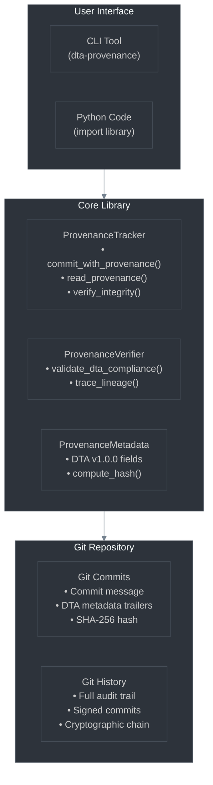

### Commit Structure

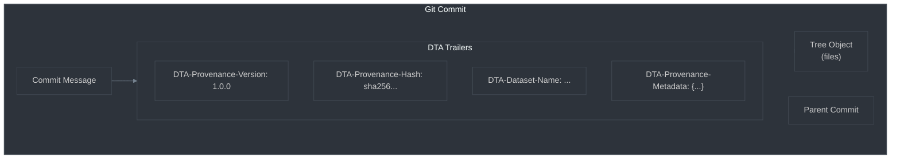

---

## Blockchain Architecture

### System Overview

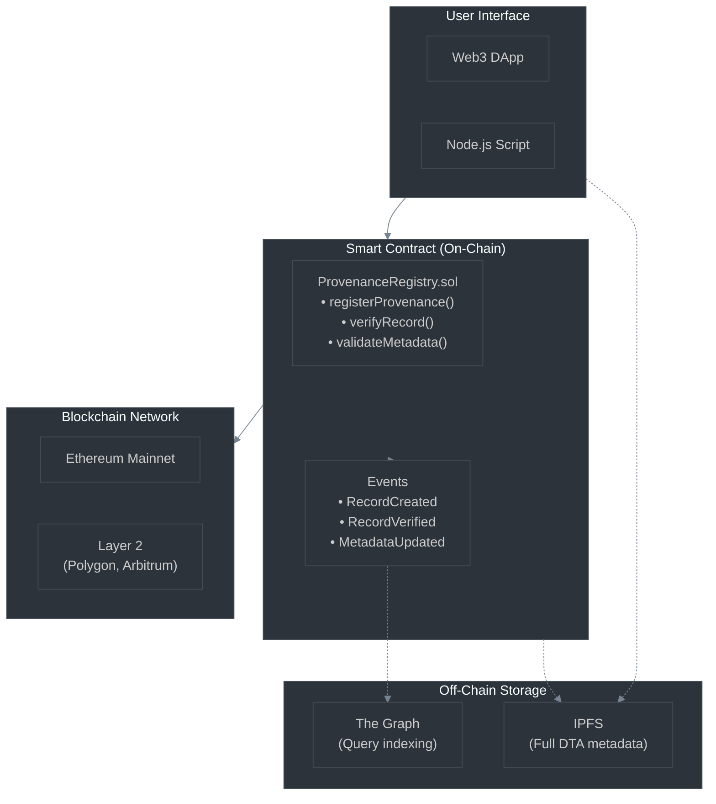

### Smart Contract Data Structure

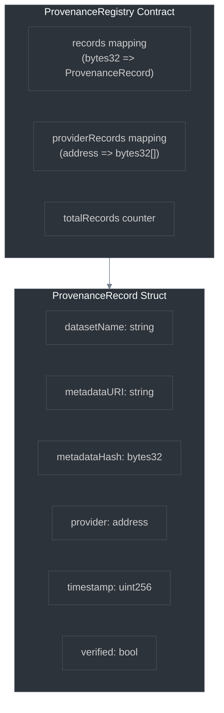

---

## Data Flow Diagrams

### Git-Native: Commit with Provenance

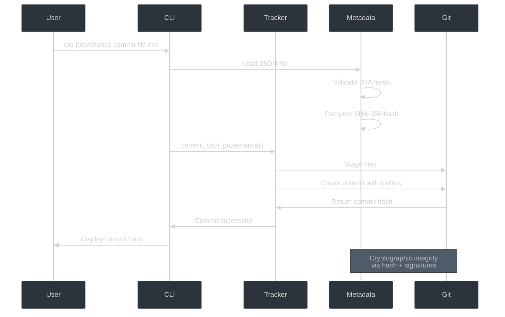

### Git-Native: Verify Integrity

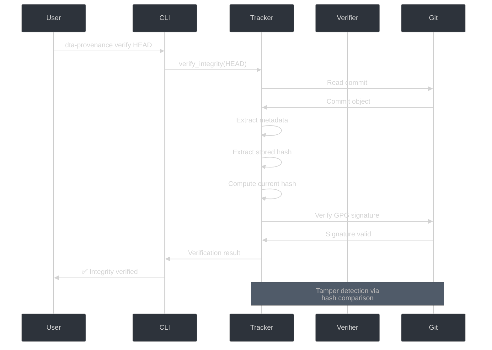

### Blockchain: Register Provenance

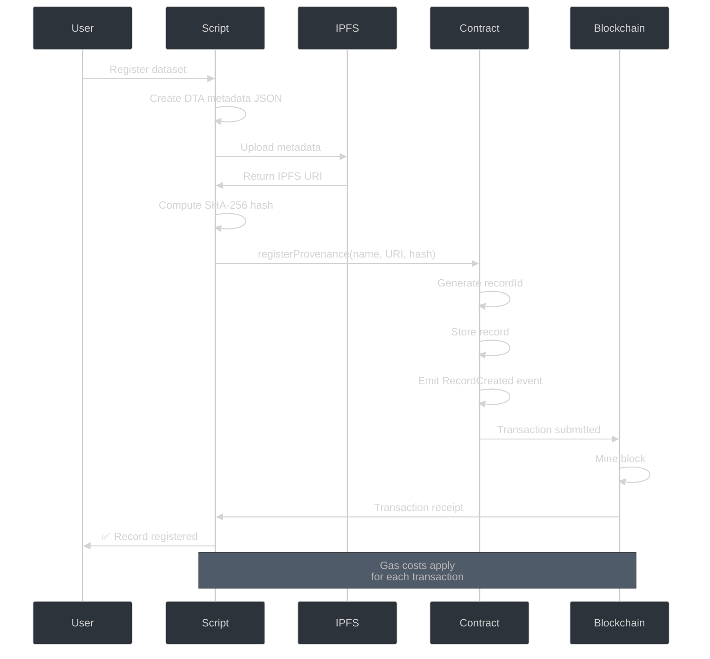

---

## Provenance Graph Structure

### Data Lineage DAG (Directed Acyclic Graph)

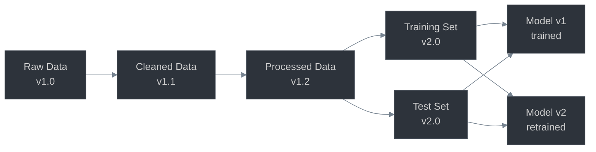

### Provenance Chain (Git Commits)

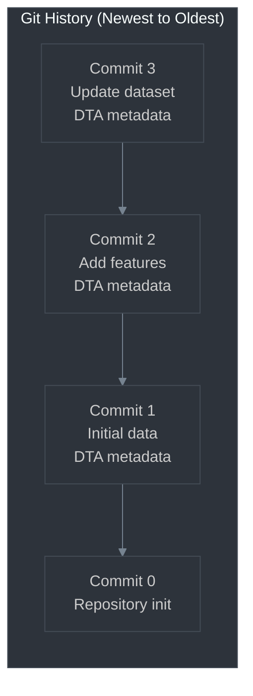

---

## Integration Patterns

### MLflow Integration

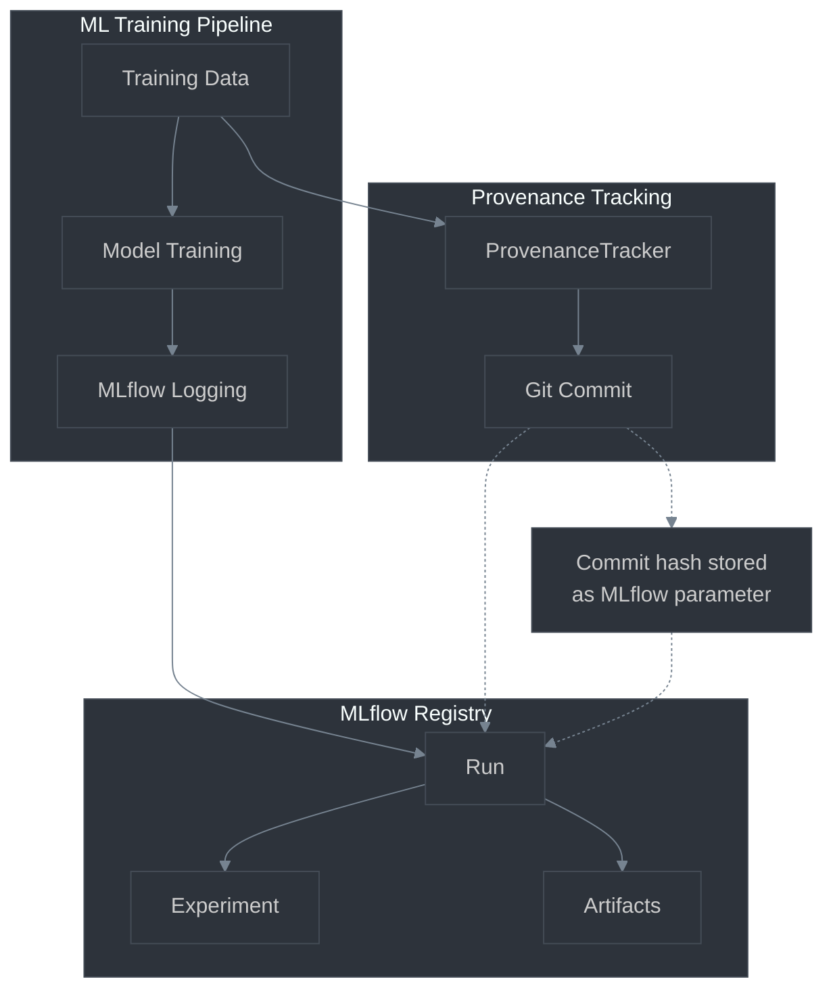

### DVC Integration

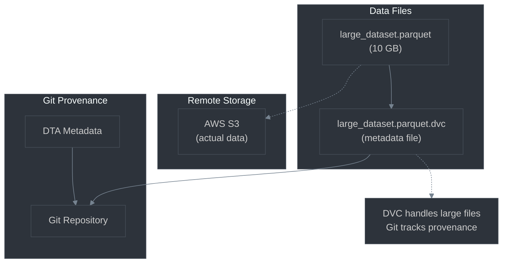

### CI/CD Pipeline Integration

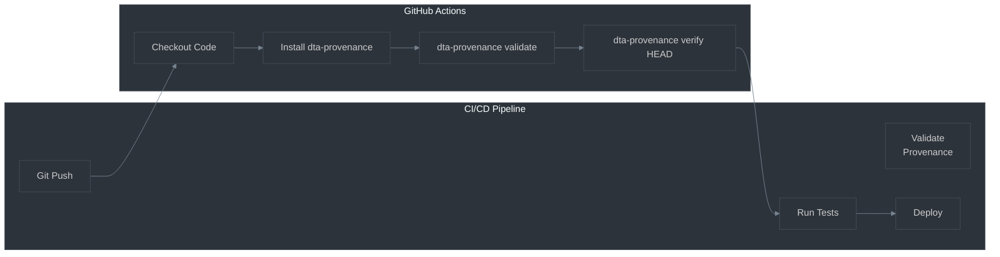

---

## DTA Metadata Structure

### Complete Field Hierarchy

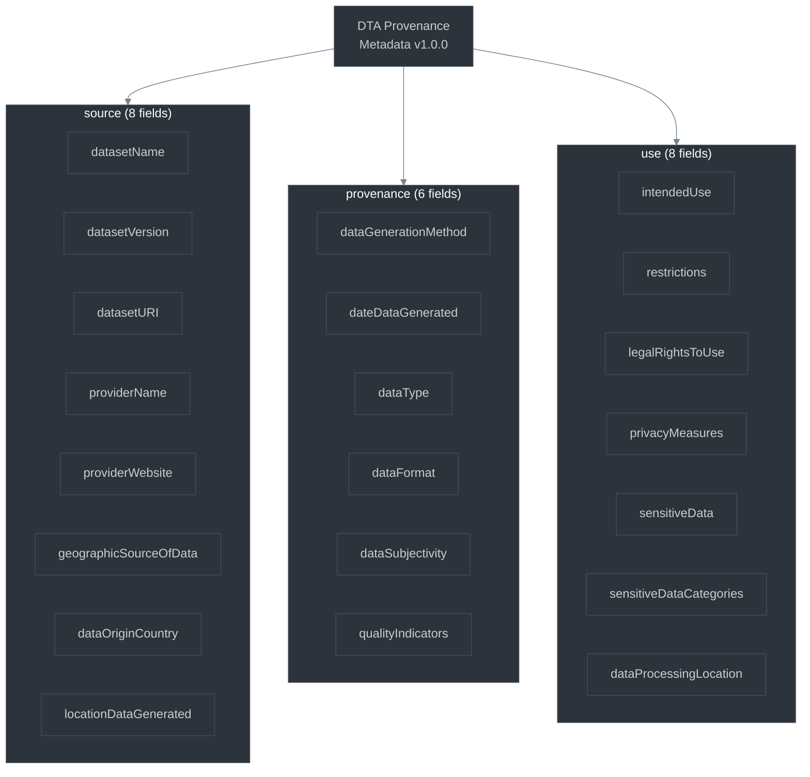

---

## Security Model

### Git-Native Security Layers

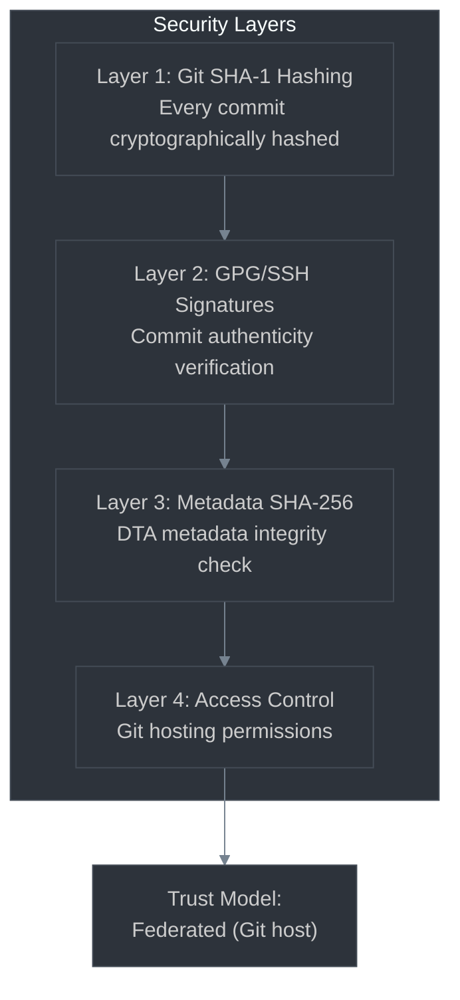

### Blockchain Security Layers

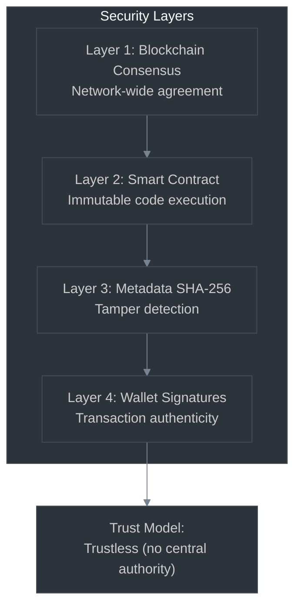

---

## Performance Characteristics

### Git-Native Performance Profile

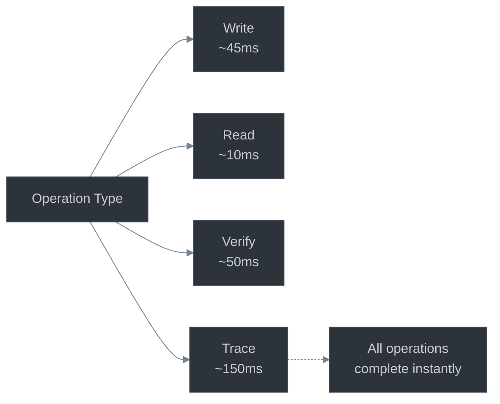

### Blockchain Performance Profile

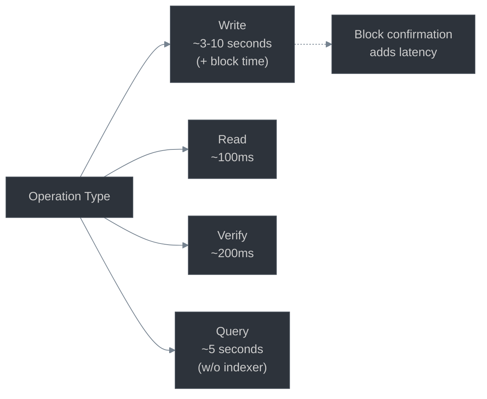

---

## Summary

Both architectures provide cryptographic provenance tracking with different trade-offs:

**Git-Native:**
- Simple, fast, free
- Private by default
- Requires trust in Git host
- Perfect for internal use

**Blockchain:**
- Complex, slower, costs money
- Public by default
- Trustless verification
- Only needed for adversarial multi-party scenarios

Choose based on your trust model, not the hype.
